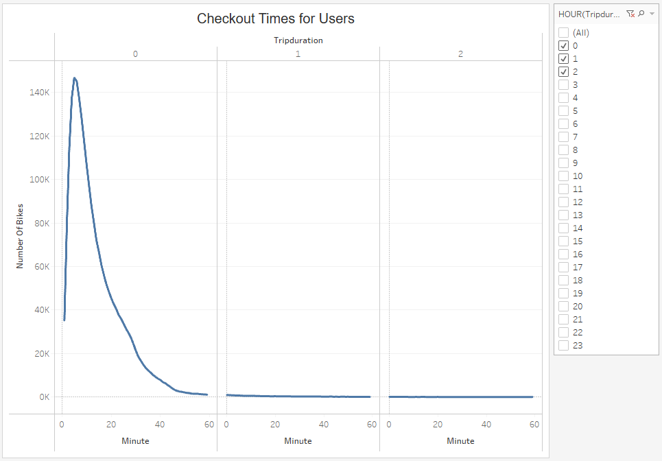
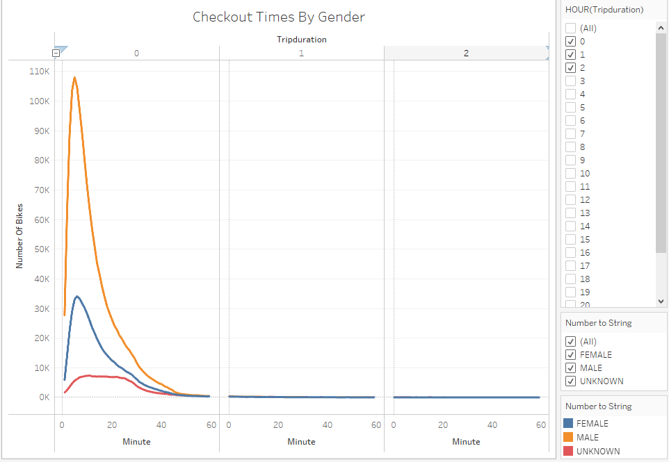
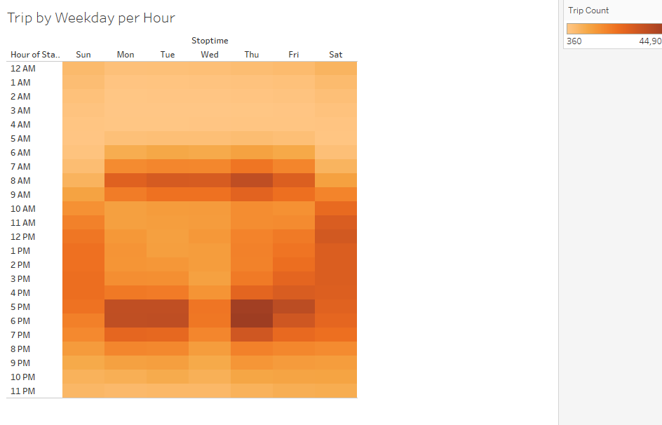
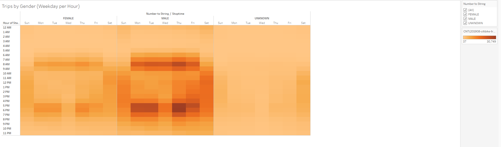
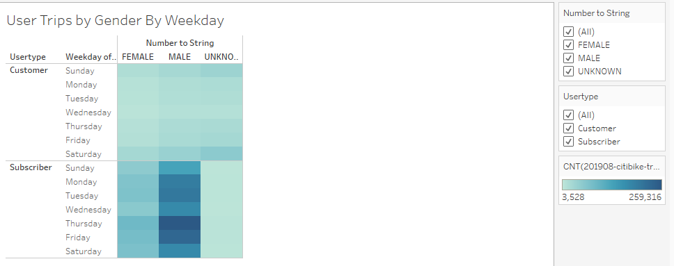
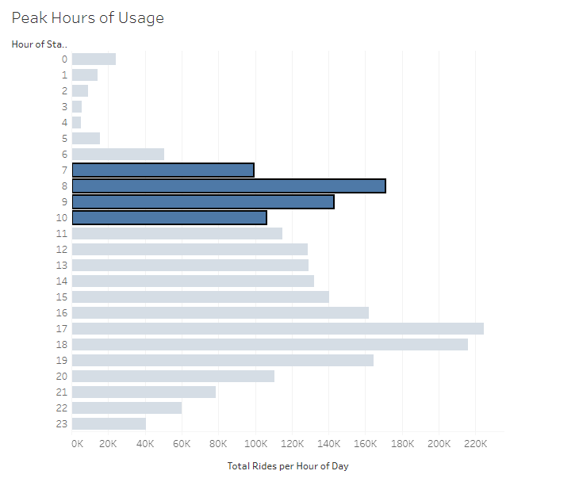
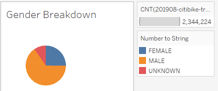

# Module-14-Challenge-Bikesharing
An analysis of NYC CitiBike bikesharing data from August, 2019, with Tableau

# Overview of Project #
The goal of this project is to use create visualtions, in order to help investors in hte bike-sharing program make a suitable decision. In order to accomplish this, analysis was carried out on the following:
1. The lenght of the time the bikes were checked out
2. THe number of bike trips for all riders
3. The number of bike trips for each type of user and gender

# Resources #
- Source Files: 201908-citibike-tripdata.csv, 201908-citibike-revised_tripdata.csv
- Software: Tableau, Python, Jupyter Notebook, Pandas Library

# Results #
## Number of Bikes based on Duration ##
   
This graphing of number of trips by duration show that the vast majority of trips taken on CitiBike bikes are under an hour in length. More specifically, most trips are under a half-hour in length, with a swift dropoff in number of rides over an hour in length.

## Number of Bikes based on each Gender by Hour ##
   

## NUmber of Bike Trips on an Hourly Basis ##
   

## Number Bike Trips by Gender on a Hourly Basis ##
   

## Number of Bike Trips based on Gender on a Daily Basis ##
   

## Peak Hours of Usage ##
   

## Gender Breakdown ##
   

# Summary #
In conclusion, bikeshare services are remarkably popular in busy metropolitan areas, where occupied real estate is densely packed and parking spaces may be scarce. The user base is made up mostly of male subscribers, providing regular income to the program. More outreach should be done to attract female riders, but male users seem a reliable market. And main usage seems focused around morning and evening commute times.

If I were to pursue additional lines of inquiry for analysis and visualization, given the data provided, I would explore:

- Trip starting and ending locations during morning and evening rush hour time-windows, to display the flow of traffic between neighborhoods at peak hours;
- Average trip duration, by birth year, by gender, to explore if there was any difference in male or female or un-gendered riders as they age.

